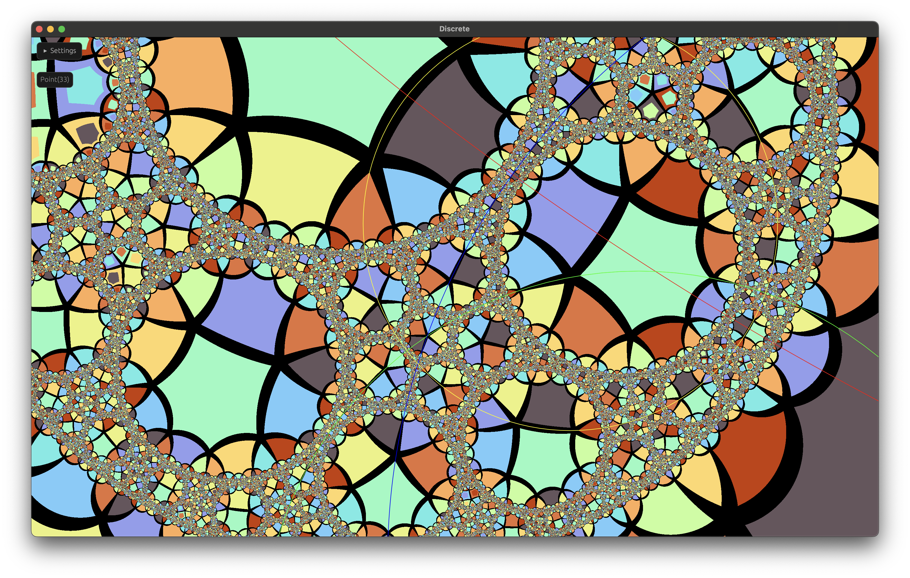

# discrete

Interactive visualization of 3D hyperbolic honeycombs using the 2D conformal boundary.

This is based on Roice Nelson and Henry Segerman's paper [Visual Hyperbolic Honeycombs](https://arxiv.org/abs/1511.02851)

